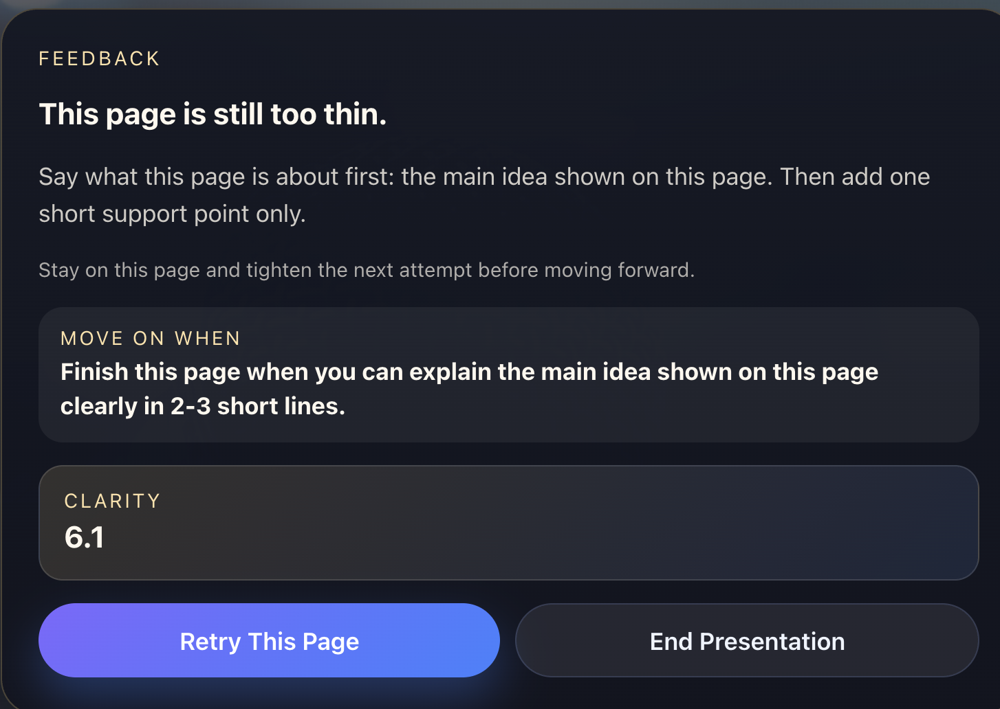
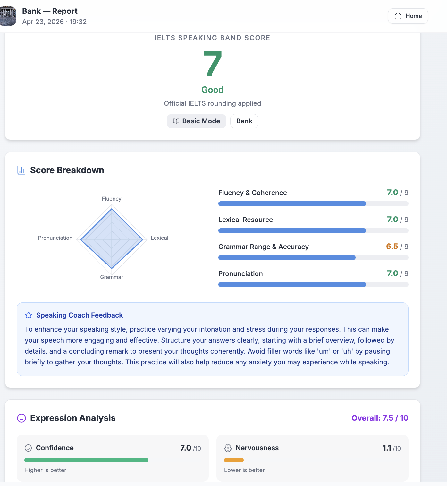

# SpeakNow

SpeakNow is a speaking-practice web application built for `ENT208TC Session 4 Group 25`. It combines scenario-based voice conversation, presentation rehearsal, progress tracking, reporting, and admin-side monitoring in one React + Vite project.

## Live Demo

- Website: `https://omniverse-ent208.vercel.app`
- Repository: `https://github.com/xuenioahh/Omniverse`

## Project Scope

The product supports two main communication workflows:

- voice conversation practice for scenario-based speaking tasks
- presentation rehearsal for slide-based speaking tasks

The current version includes authentication, protected routes, report generation, history pages, profile insights, and admin-facing analytics. The app is designed to remain reviewable both as a deployed website and as a local-first coursework codebase.

## Team

- Yujie Yang — `2363253`
- Zihan Jiang — `2362327`
- Yile Zhang — `2363305`
- Xinyu Shen — `2363210`
- Zhuoru Zhang — `2363097`
- Zimu Zhang — `2364249`
- Ye Li — `2362556`

## Main Features

- register and sign-in flow with protected routes
- scenario-based voice conversation practice
- presentation rehearsal with PDF upload and slide-aware feedback
- session reports and practice history
- profile page with progress summaries
- admin dashboard with activity and session visibility
- local-first fallback behaviour with hosted persistence support

## User Flow

### Voice Practice

1. Sign in to the app.
2. Choose a speaking scenario.
3. Configure the session mode.
4. Complete a live voice practice session.
5. Review the generated feedback report and history.

### Presentation Practice

1. Sign in to the app.
2. Upload a PDF or prepare presentation material.
3. Rehearse the presentation flow.
4. Receive analysis and pause-level feedback.
5. Review the final report and saved history.

## Technology Stack

- React 18
- React Router
- Vite
- Tailwind CSS
- Radix UI / shadcn-style components
- TanStack Query
- Vercel API routes
- Supabase-backed storage with local fallback support

## Screenshots

### Presentation feedback



### Voice practice report



## Local Development

```bash
npm install
npm run dev
```

`npm run dev` starts both the Vite frontend and the local Node backend for `/api/*`.

If needed, the two sides can also be started separately:

```bash
npm run dev:frontend
npm run dev:backend
```

## Available Scripts

- `npm run dev` starts local development
- `npm run dev:frontend` starts only the frontend
- `npm run dev:backend` starts only the local backend
- `npm run build` creates a production build
- `npm run lint` runs ESLint
- `npm run lint:fix` auto-fixes lint issues where possible
- `npm run typecheck` runs configured type checking
- `npm run preview` previews the production build locally

## Repository Structure

- `src/pages/` route-level application pages
- `src/components/` reusable feature and UI components
- `src/lib/` storage, business logic, and shared utilities
- `src/api/` frontend-side API wrappers
- `api/` server-style endpoints for analysis, persistence, and admin tracking
- `backend/` local development backend entry
- `public/` static assets
- `supabase/` schema files for hosted persistence
- `docs/images/` README screenshot assets

## Environment Notes

- `.env.example` is included as a setup reference
- browser media permissions matter for microphone and camera features
- local backend port defaults to `8787` and can be changed with `BACKEND_PORT`
- hosted storage uses Supabase when configured
- local fallback storage is available for coursework review and development

## Admin Access

To create multiple admin accounts locally:

1. Add one or more seed emails to `VITE_ADMIN_EMAILS`.
2. Start the app with `npm run dev`.
3. Register or sign in using one of those emails.
4. Open `/admin`.
5. Add more admin emails from the Admin Dashboard UI if needed.

## Additional Documents

- [RELEASE_NOTES.md](./RELEASE_NOTES.md)
- [ADMIN_BACKEND_SETUP.md](./ADMIN_BACKEND_SETUP.md)
- [COMPLETE_TECHNICAL_REPORT.md](./COMPLETE_TECHNICAL_REPORT.md)
- [COMPLETE_TECHNICAL_REPORT_BILINGUAL.md](./COMPLETE_TECHNICAL_REPORT_BILINGUAL.md)
